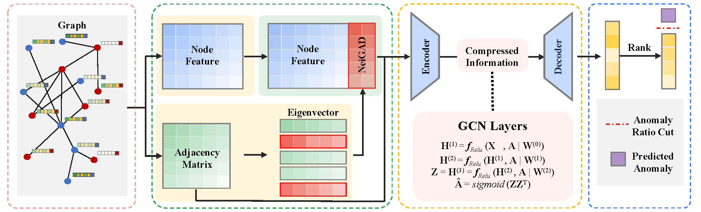

# NeiGAD: Augmenting Graph Anomaly Detection via Spectral Neighbor Information

The official implementation of NeiGAD (IWCMC 2026)

Qing Qing, Huafei Huang, Mingliang Hou, Renqiang Luo, Mohsen Guizani
## Abstract

Graph anomaly detection (GAD) aims to identify irregular nodes or structures in attributed graphs. Neighbor information, which reflects both structural connectivity and attribute consistency with surrounding nodes, is essential for distinguishing anomalies from normal patterns. Although recent graph neural network (GNN)-based methods incorporate such information through message passing, they often fail to explicitly model its effect or interaction with attributes, limiting detection performance. This work introduces NeiGAD, a novel plug-and-play module that captures neighbor information through spectral graph analysis. Theoretical insights demonstrate that eigenvectors of the adjacency matrix encode local neighbor interactions and progressively amplify anomaly signals. Based on this, NeiGAD selects a compact set of eigenvectors to construct efficient and discriminative representations. Experiments on eight real-world datasets show that NeiGAD consistently improves detection accuracy and outperforms state-of-the-art GAD methods. These results demonstrate the importance of explicit neighbor modeling and the effectiveness of spectral analysis in anomaly detection. 





## How to run the code

run the code for training Graph Anomaly Detection

```
python train.py --gpu $gpu --dataset $dataset --model 'MLPAE' --nhidden 32 --pe_method 'adj' --pe_dim 15 --feat_norm 'none' --nlayer 4

python train.py --gpu $gpu --dataset $dataset --model 'GCNAE' --nhidden 16 --pe_method 'adj' --pe_dim 12 --feat_norm 'none' --nlayer 4

python train.py --gpu $gpu --dataset $dataset --model 'DOMINANT' --nhidden 128 --pe_method 'adj' --pe_dim 11 --feat_norm 'none' --nlayer 3

python train.py --gpu $gpu --dataset $dataset --model 'AnomalyDAE' --nhidden 128 --pe_method 'adj' --pe_dim 6 --feat_norm 'none' --nlayer 2
```

or
```
./run.sh
```

